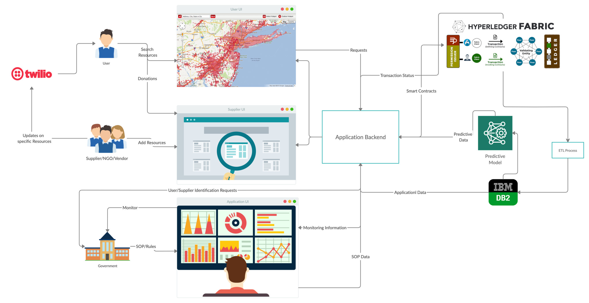
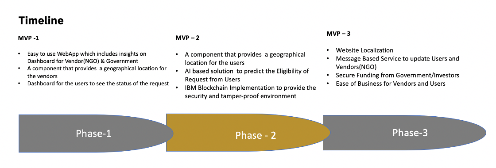
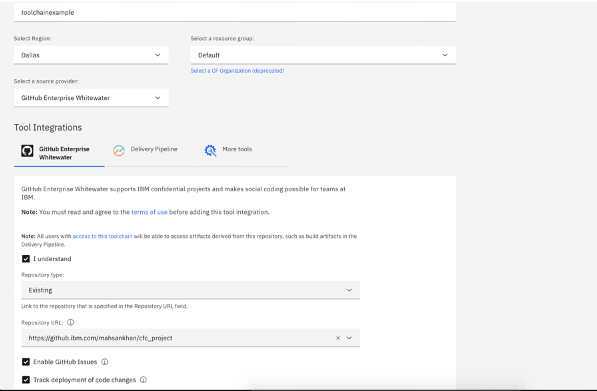

[](https://www.apache.org/licenses/LICENSE-2.0) [](https://callforcode.org/slack) [](https://al-wasal-connect.eu-gb.mybluemix.net/)

## Contents

1. [Description](#description)
1. [Demo video](#demo-video)
1. [The architecture](#the-architecture)
1. [Long description](#long-description)
1. [Project roadmap](#project-roadmap)
1. [Getting started](#getting-started)
1. [Live demo](#live-demo)
1. [Built with](#built-with)
1. [Version](#versioning)
1. [Authors](#authors)
1. [License](#license)

## Description

### What's the problem?

Due to the current global pandemic, every country is going through economic crisis and food and other amenities supply chain has been disrupted. This disruption has caused food shortage, hoarding, mismanagement of goods. Both of these issues have especially affected lower middle class and poor strata of the population, who are not able to access essential items either due to non availability or unaffordability of goods. To provide them with basic necessities different NGOs and government agencies are conducting ration drives. However, due to lack of communication between these organisations, these necessities aren’t being evenly distributed (some families not getting supplies while others getting it multiple times)

### How can Al-Wasl.Connect platform help?

Platform where needy users can put up request, which is visible to all the NGOs and donors registered on this application. The request is validated through information available from government portal related to the financial status of the family and the current aid statistics pertaining to the family under consideration that have already been added in the portal if any family member has received aid in near past. Based on these statistics, request would be either accepted or it would be rejected. The solution also takes into account the geographical proximity while routing request and also, would use machine learning techniques for ranking the needy users if the resources available are currently less than the number of requests.  The solution would also predict the future aid requests for a certain area based on historical records

### Our Vision

NGOs raised the concerns regarding the legitimacy and transparency of the distribution of ration and other goods. We collaborated with NGOs in order to better understand the problem and hence, are proposing a blockchain and analytics based system that help mitigate this issue through distributed ledger of transactions. Hoarding of goods is another issue that countries all over the world are facing, this solution will also address this issue through decision system that restricts individuals from getting excessive amount of goods.

## Demo video

[Here](https://ibm.box.com/s/f0c6ho9ca6p5gw3o1k8u3dp1lfkn7o64)


## The architecture



## Project roadmap




## Getting started

These instructions will get you a copy of the project up and running on your local machine for development and testing purposes. See deployment for notes on how to deploy the project on a live system.

### Prerequisites

1. [IBM Account]( http://ibm.biz/C4CBeirut)
1. [Install IBM CLI tool](https://cloud.ibm.com/docs/cli?topic=cli-install-ibmcloud-cli)
1. [GitHub Account](https://github.com/)


### Installing

Kindly follow below steps to run the application successfully 

## Db2 service:
1.	Search db2 service, select __lite plan__ and create.
1.	Open db2 service from resource list and click __Open Console__
1.	Create New implicit schema
1.	Select three dots on left, then click __Load Data__
1.	Drop data .csv file, select target schema
1.	Create new table 
1.	Once everything is done click __Begin Load__


## Backend service:
1.	Backend service is implemented in node.js
1.	Backend server is available [here](https://github.com/Call-for-Code/Al-Wasl.Connect/tree/backend)
1.	Move into the directory and make the changes as below:
    1.	In __manifest.yml__ change name and host field to some unique value.
    1.	Please add __.env__ file with your db2 credentials 
1.	Once  above steps are completed, pass __cf push 'name of app'__ command to create the IBM Cloud Foundry service.


## Frontend service :
1.	Frontend service is implemented in angular 9
1.	Applicaiton frontend is available [here](https://github.com/Call-for-Code/Al-Wasl.Connect/tree/frontend)
1.	Update __.env__ file with db2 service credentials
1.	Update route in env files: 
```bash 
Open src folder -> environments (update .ts & .prod files where the backend server is URL running  eg https://trustdon....eu-gb.mybluemix.net/) 
 ```
1.	Run __“npm install”__
1.	Run __“yarn install”__
1.	Then build the project __“ng build”__
1.	Now you can see the __“Dist”__ folder , add manifest.yml (keep name unique, see server repository for manifest example file) 
1.	Push only __Dist__ folder files to your GitHub repositry
1. Need to integrate __IBM Toolchain__ service for Continuous Integration and deployment
1.	Open IBM Account search for Toolchain and select develop a Cloud Foundry app. 

***NOTE : Clone the application and push it under your GitHub account and provide the URL. Because pipeline will not trigger if some changes are made in the repository.***



12.	In __Delivery Pipeline__ section , select new -> ok (it will generate a new API)
13.	Once above steps are completed click __Create__.
14.	This toolchain will automatically create a Cloud Foundry app for you go to resources list and check application would be up and running.

## Live demo

You can find a running application at [here](https://al-wasal-connect.eu-gb.mybluemix.net/)

__Credentials__

1. Donor Login
   - Registration # : 1234567890112
   - password : 1234

1. Government Login
    - Username : govt
    - password : admin


## Built with
* [IBM Cloud Foundry](https://cloud.ibm.com/cloudfoundry/overview)
* [IBM Toolchain](https://cloud.ibm.com/devops/create)
* [IBM db2 simple](https://cloud.ibm.com/catalog/services/db2)
* [Node.js](https://nodejs.org/en/)
* [Angular](https://angular.io/)

## Version

v1.0

## Authors

See also the list of [contributors](https://github.com/Call-for-Code/Al-Wasl.Connect/graphs/contributors) who participated in this project.

## License

This project is licensed under the Apache 2 License - see the [LICENSE](LICENSE) file for details
